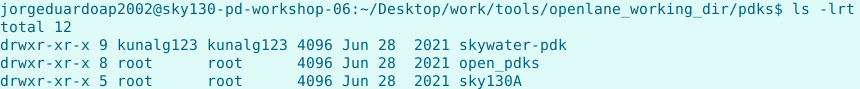
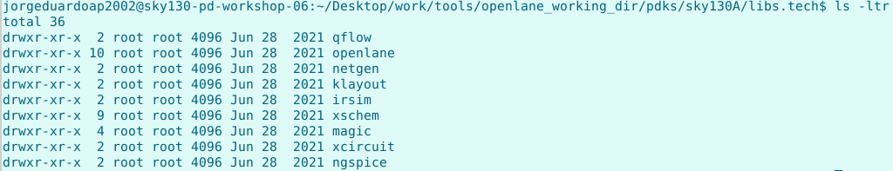
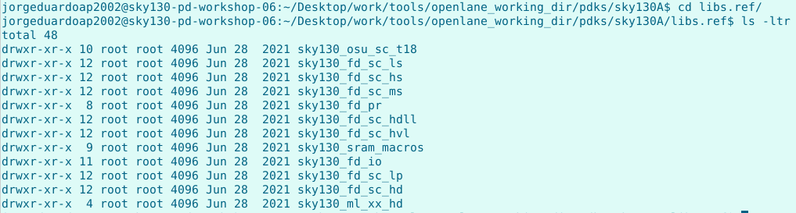
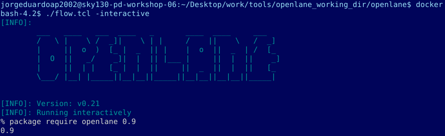
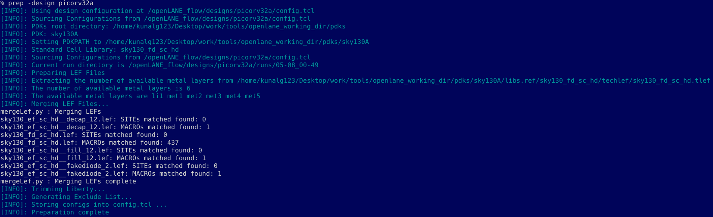
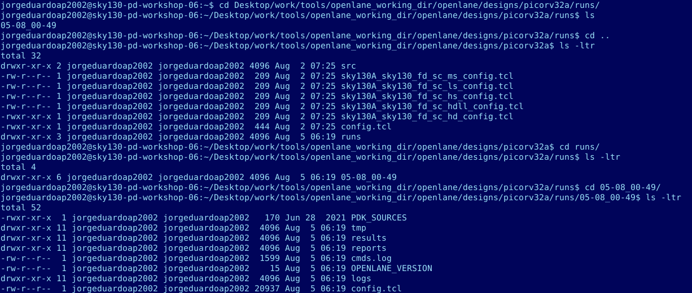
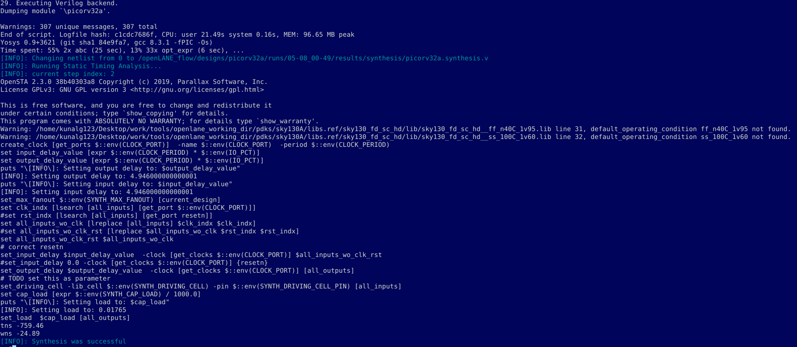
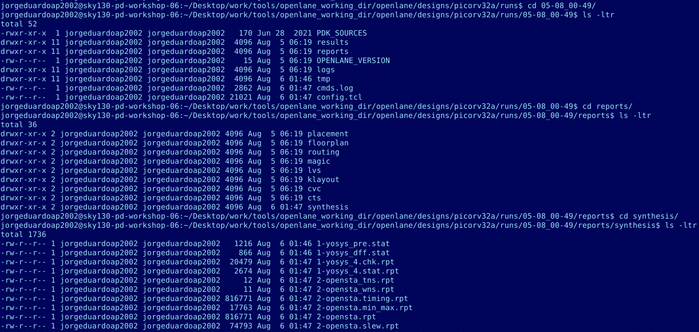
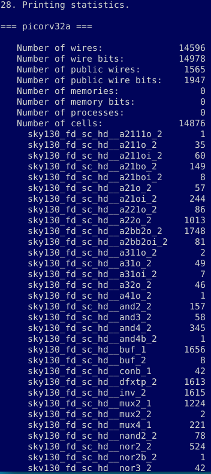
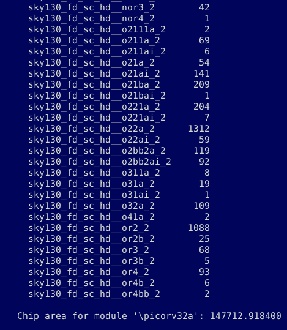

# OpenLANE-Sky130-workshop
Material for the advanced physical design workshop

# Table of Contents
  - [Day 1 - Inception of open-source EDA, OpenLANE and Sky130 PDK](#day-1)
  - [Day 2 - Good floorplan vs bad floorplan and introduction to library cells](#day-2)
  - [Day 3 - Design library cell using Magic Layout and ngspice characterization](#day-3)
  - [Day 4 - Pre-layout timing analysis and importance of good clock tree](#day-4)
  - [Day 5 - Final steps for RTL2GDS](#day-5)

# 1st Day
## PDKs and Libraries
First, we look for the PDKs:

And for the libraries:

## Docker and OpenLane
We use Openlane with Docker:

Preparing the project _picorv32a_

Checking reports:

## Synthesis
Running Synthesis:

Checking Synthesis reports:

You can see some statistics related to the design

# 2nd Day

