# OpenLANE-Sky130-workshop
Material for the advanced physical design workshop

# Table of Contents
  - [Day 1 - Inception of open-source EDA, OpenLANE and Sky130 PDK](#1st_Day)
  - [Day 2 - Good floorplan vs bad floorplan and introduction to library cells](#2nd_Day)
  - [Day 3 - Design library cell using Magic Layout and ngspice characterization](#3rd_Day)
  - [Day 4 - Pre-layout timing analysis and importance of good clock tree](#4th_Day)
  - [Day 5 - Final steps for RTL2GDS](#5th_Day)

# 1st_Day
## PDKs and Libraries
First, we look for the PDKs:

And for the libraries:

## Docker and OpenLane
We use Openlane with Docker:

Preparing the project _picorv32a_

Checking reports:

## Synthesis
Running Synthesis:

Checking Synthesis reports:

You can see some statistics related to the design

For the Flip flop ratio: FFr = 1613/14876 = 10.85%

# 2nd_Day
## Floorplanning in our project 
Checking the variables used in this stage:
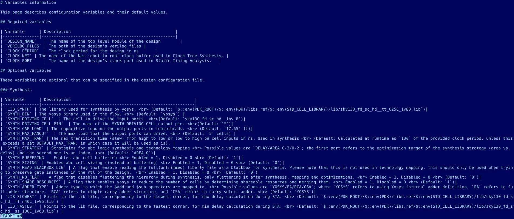

floorplan.tcl:
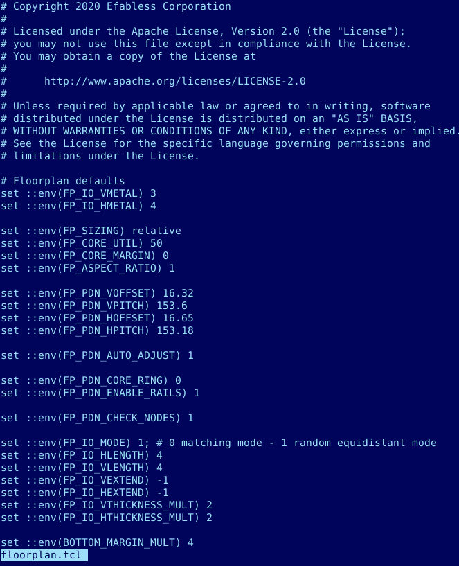

config.tcl:
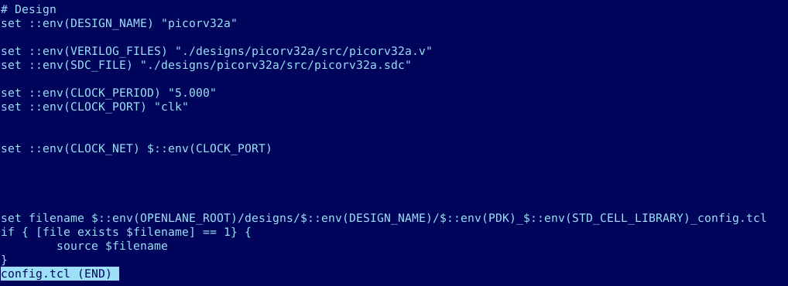

Running floorplan:
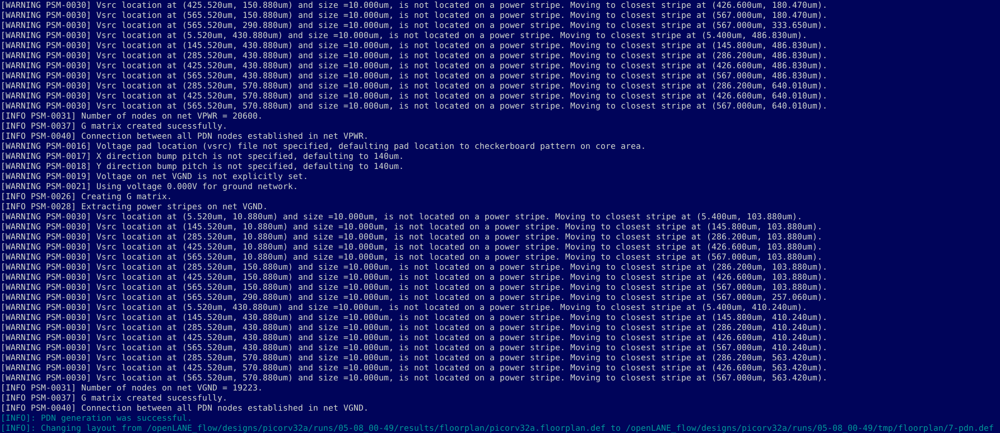

Checking in logs folder:
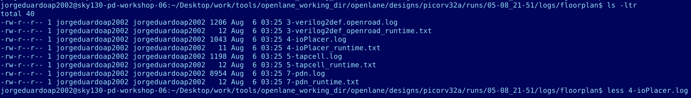
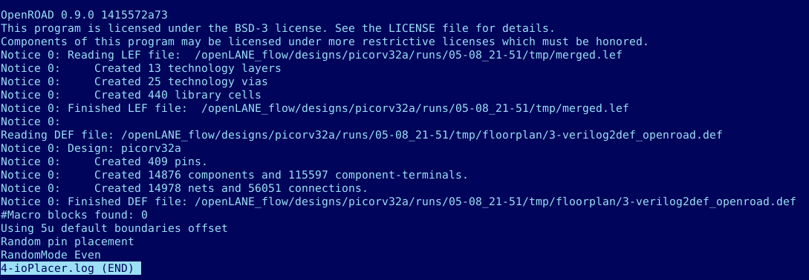

Checking .def file:

Then, we open Magic:
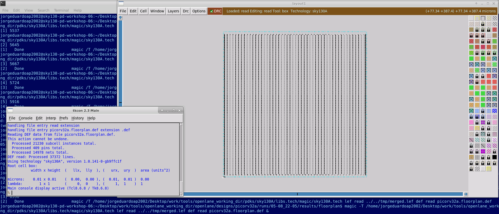
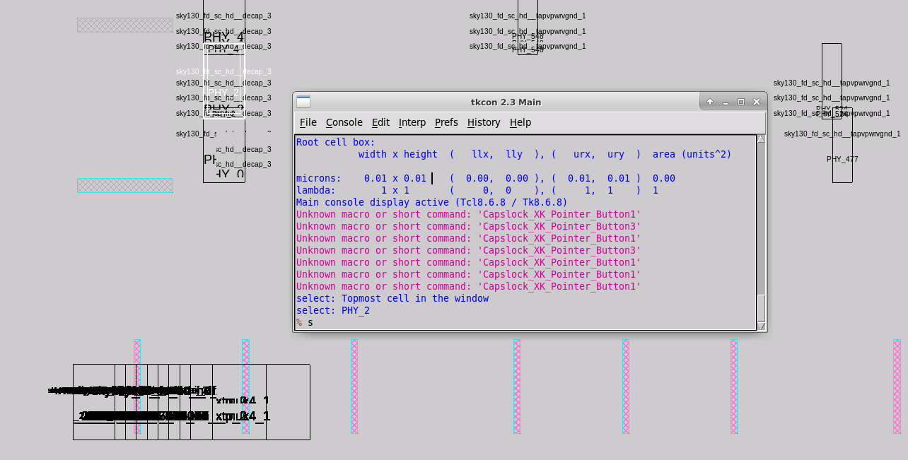

## Placement:

We continue with Placement
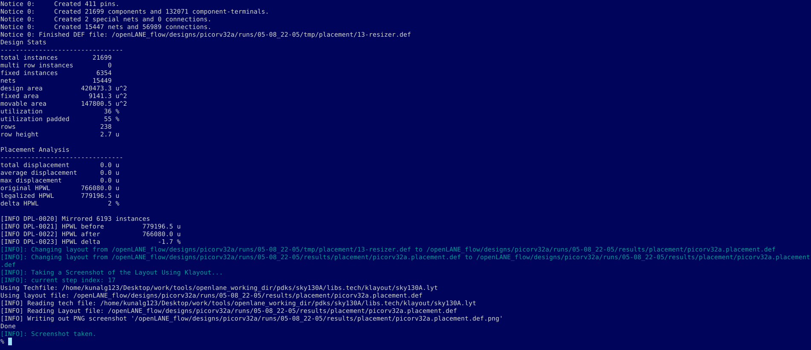

And the new layout:
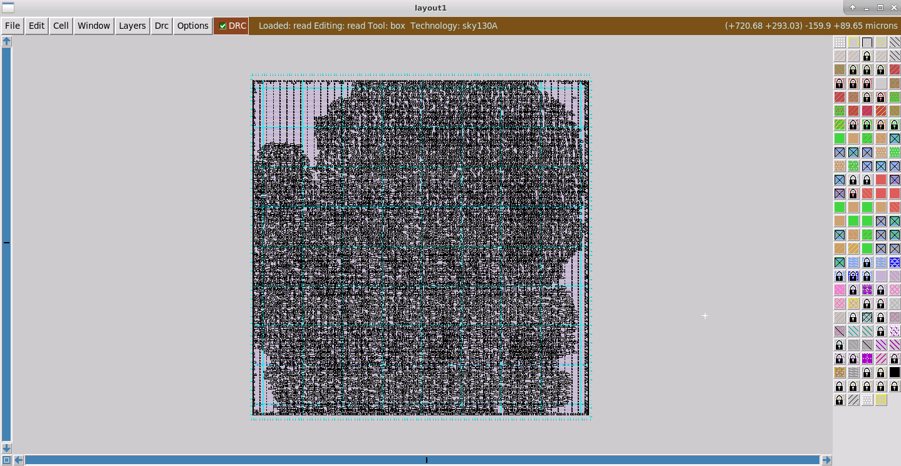
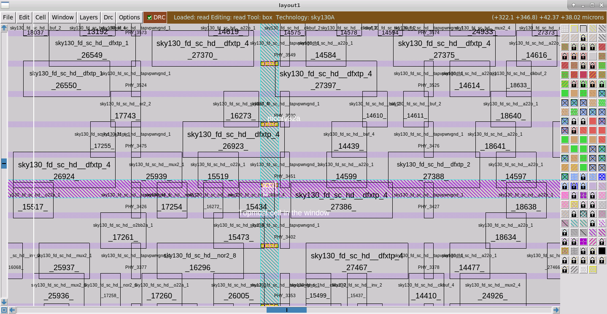

# 3rd_day

## Clonning git
First, we clone this repository https://github.com/nickson-jose/vsdstdcelldesign.git
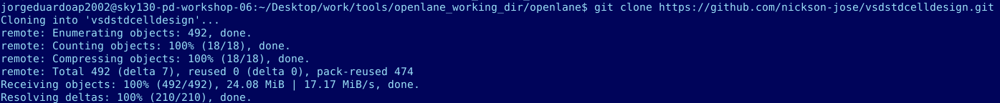

Opening the inverter layout:
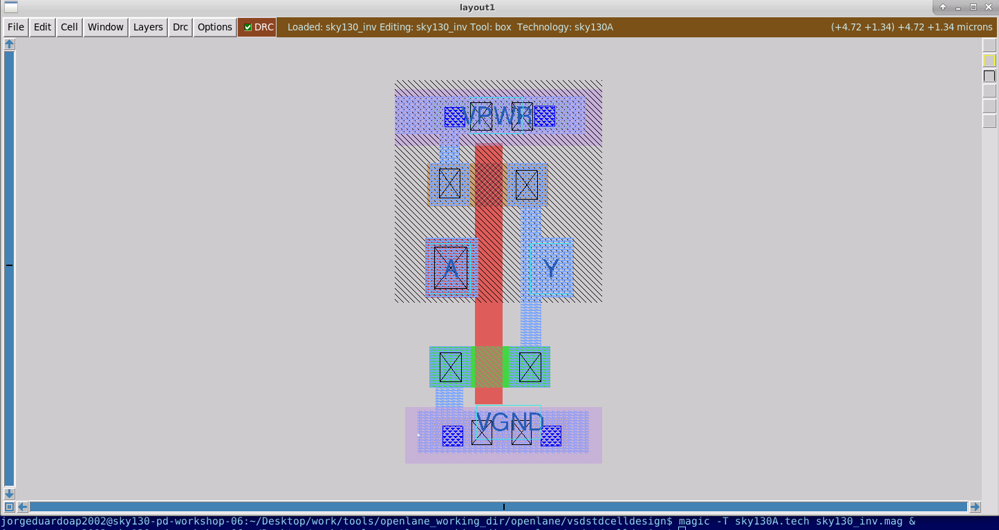

Checking the layout:
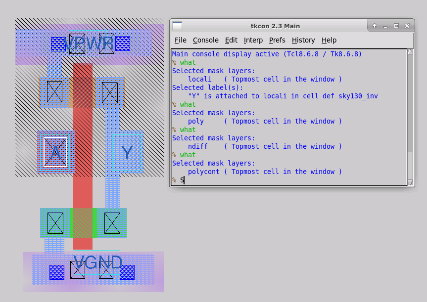

Generating a DRC error:
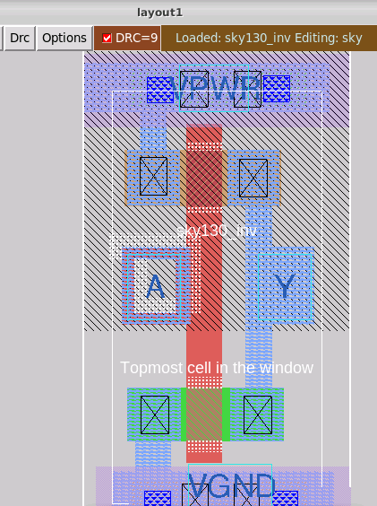

## Spice
Extracting to spice:
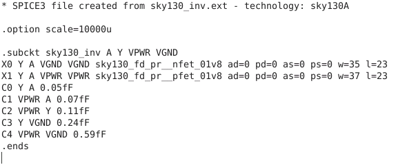

Editing this document:
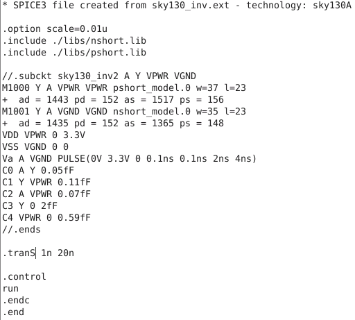

Running simulation with _nspice_:
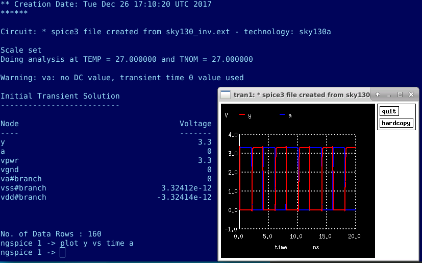

Calculating rise, fall and propagation delay:
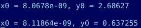

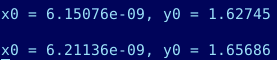

trise = 0.1356 ns
tfall = 0.0508 ns
PropDelay = 0.0606 ns

#4th Day
## Export to .lef
We edit and generate a .lef file from the last inverter:
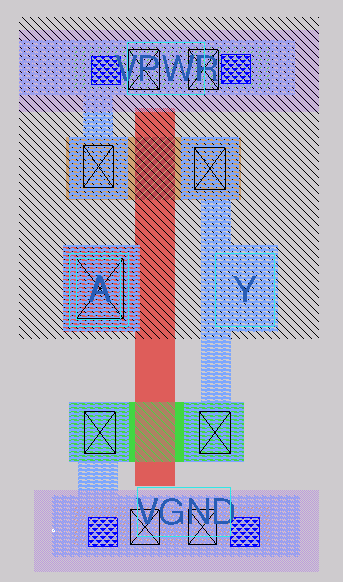
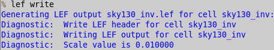
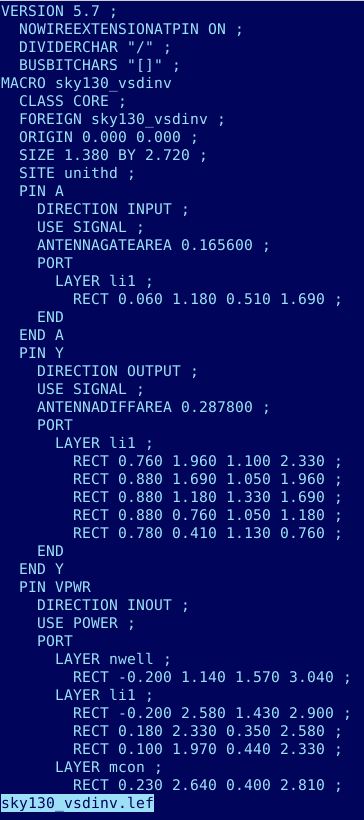

To use them, we have to edit the config.tcl
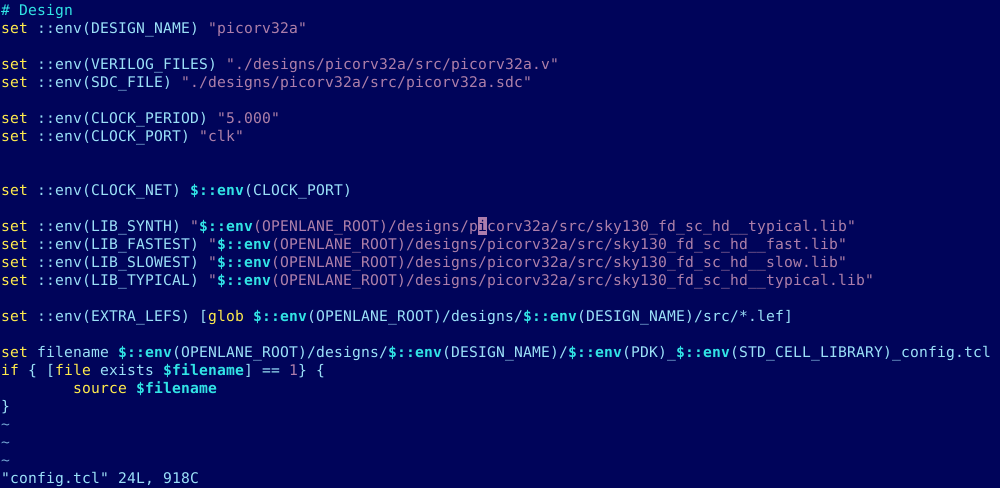

## Reruning synthesis 
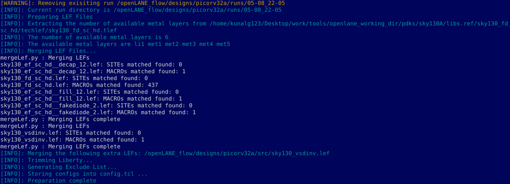
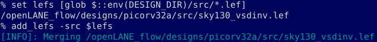
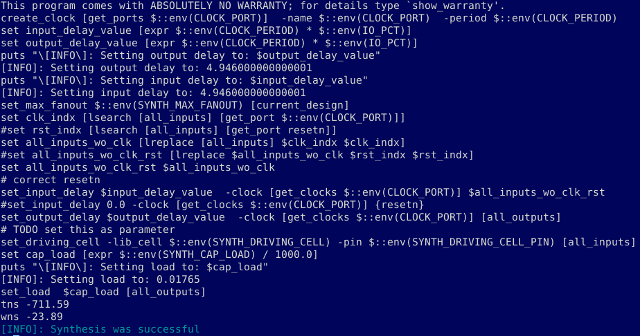
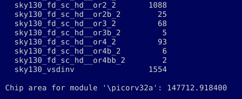

Trying to improve timing:
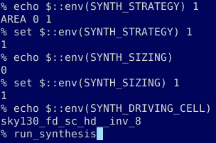
